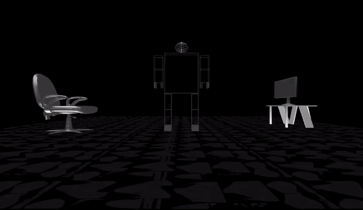

# Graphics-Project-**Team 16**
## 1. Team ID: **16**
## 2. Team Members

*    Name: Ibrahem Elsayed Ibrahim\
    Seat Number: 53001\
    E-mail: hemasayed600@gmail.com
    
*    Name: Bishoy Magdy Morkos\
    Seat Number: 53024\
    E-mail: bishoymagdi626@gmail.com

*    Name: Renad Taher Mahmoud\
    Seat Number: 53032\
    E-mail: renad.taher12@gmail.com

*    Name: Reham Abd-Elfattah Ismail\
    Seat Number: 53033\
    E-mail: rehamabdelfatah2@gmail.com

* Name: Mostafa Yehia Mohammed\
    Seat Number: 53078\
    E-mail: mustafayehia4@gmail.com

## 3. Implementation Steps and Results
1. Floors and Textures Implementation: 
    * We downloaded jpec images of textures.
    * We converted jpec images to bmp (24 bit depth).
    * We put our textures into the code while scaling the images in the X-axis.
    * Result :  

2. A menu pinned to the right mouse button to change the floor texture:
    * We implemented the seven floors in the screen-menu function.
    * Result :  

3. Objects Download : 
    * Implementing objects in the scene then scaling them to the suitable size and translating them to the required position. 

4. Three Animations : Click on letter 'a' to start the animations:  \
Results :
    * Moving \
     \
    

    * Jumping \
    

    * Interaction with object : \
    Sitting on the chair \
    
    

## 4. Problems Faced and Their Fixes
* There was a compilation error using this command : \
    gcc -o main main.cpp imageloader.cpp glm.cpp -lGL -lGLU -lglut -lm  
    * This was fixed by adding (-lstdc++) to the command line. 
    * So the final command line is : \
gcc -o main main.cpp imageloader.cpp glm.cpp -lGL -lGLU -lglut -lm -lstdc++ 

* There was a problem in most of the images that they appeared in a different colour (Light blue colour)
    * This was fixed by converting images to 24-bit depth.

* Styling of robot and putting it in a certain position.
    * It was adjusted bs scaling and translating the robot.

* There was a problem in obtaining the sequence of animations and adjusting timers.

## 5. Conclusion and Biomedical Application For Our Robot
Since our project was to design a robot with animations that can interact with objects, so we will be explaining how useful the robot can be used from a biomedical point of view. It can be used in many medical applications, but lets highlight some of them: 
* The First Application is **Robotic Surgery** : \
 Robotic surgeries can do what doctors can't because of the *accuracy* and *repeatability* of robotic systems. In addition, robots are capable of operating within the contained space of the human body. All of these make robots particularly suitable for non-invasive or minimally invasive surgeries. \
And to improve the results of surgery. Today, robots have been shown or routinely used for heart, brain, spinal cord, throat, and knee surgeries in many hospitals worldwide. As robotic surgery improves *consistency* and *quality*, it is becoming more and more popular.
* The second application is **Robotic Home care, Nursing and Diagnosis**. \
 Such application may be of good use for paralysis patients, and patients suffering from any sickness that makes their movement difficult and that have no one to take good care of them.
The robot can be Programmed to provide medication on time and to assist the patient in their daily life routine. The robot can also have some assisting diagnosis equipment like an infra-red temperature measuring device that can follow the temperature of the patient and reads it a couple of times daily. It can also be able to follow the oxygen level in the patient’s body using some sensors. The robot can be programmed to be able to connect to the mobile network. So that in case of any emergency, the robot can dial the emergency number or any other number registered on the mobile phone saving the patient.
